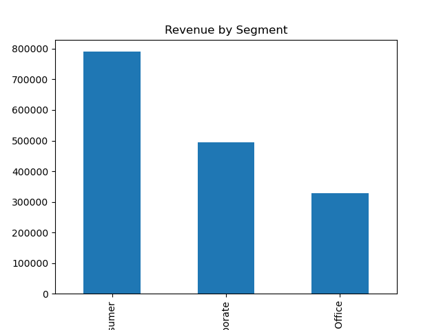

# 📊 Sales Insight Pro – E-Commerce Sales Analytics Dashboard

🚀 An end-to-end data analytics project combining **data processing, interactive dashboards, and web app deployment** to analyze e-commerce sales performance.

---

## 🔥 Live Demo
🌐 Streamlit App: *https://sales-insight-pro.streamlit.app/*  
📁 Power BI Dashboard: Available in `/dashboard/powerbi.pbix`

---

## 📌 Project Overview

This project analyzes e-commerce sales data to uncover:

- 📈 Revenue trends over time  
- 📦 Performance across customer segments  
- 🌍 Geographic distribution of sales  
- 💡 Key business insights  

It demonstrates the complete analytics workflow from **raw data → insights → interactive dashboards**.

---

## 🛠️ Tech Stack

- **Python** (Pandas, NumPy)  
- **Streamlit** (Web App)  
- **Power BI** (Dashboarding)  
- **Excel / CSV** (Data Storage)  

---

## 📂 Project Structure

```

ECommerce-Sales-Analytics/
┣ app/
┃ ┣ app.py
┃ ┣ config.py
┃ ┗ utils.py
┣ data/
┃ ┗ cleaned_data.csv
┣ dashboard/
┃ ┗ powerbi.pbix
┣ notebooks/
┃ ┣ data_cleaning.ipynb
┃ ┣ eda.ipynb
┃ ┗ feature_engineering.ipynb
┣ images/
┃ ┣ kpi_cards.png
┃ ┣ sales_trend.png
┃ ┗ dashboard_preview.png
┣ requirements.txt
┗ README.md

```

---

## ⚙️ Data Pipeline

1. **Data Cleaning**
   - Removed missing values  
   - Standardized column names  
   - Converted date formats  

2. **Feature Engineering**
   - Extracted `year` and `month`  
   - Created `revenue` column  

3. **Final Dataset**
   - Saved as `cleaned_data.csv`  
   - Used across Power BI & Streamlit  

---

## 📊 Power BI Dashboard

### Key Features:
- KPI Cards (Revenue, Orders, Avg Order Value)  
- Revenue Trend (Quarter-wise)  
- Segment Analysis  
- Geographic Insights (Map)  
- Interactive Filters (State, Segment, Date)  

📸 Preview:



---

## 🌐 Streamlit Web App

### Features:
- Interactive filters (State, Segment, Date)  
- Dynamic KPI updates  
- Time-series analysis  
- Segment-wise comparison  
- Real-time insights  

### Run Locally:

```bash
pip install -r requirements.txt
streamlit run app/app.py
```


---

## 💡 Key Insights

- Consumer segment generates the highest revenue  
- Revenue shows consistent growth across quarters  
- Certain states contribute disproportionately to sales  

---

## 🧠 Skills Demonstrated

- Data Cleaning & Preprocessing  
- Exploratory Data Analysis (EDA)  
- Data Visualization  
- Dashboard Design  
- Web App Deployment  
- Business Insight Generation  

---

## 👤 Author

**Rajarshi Saha**  
